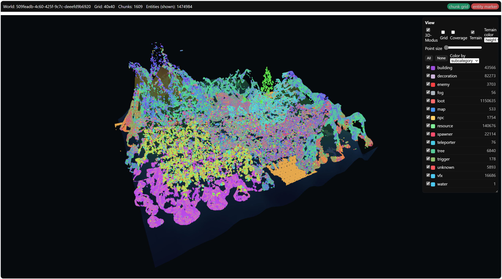

# EEV — Enshrouded Entity Viewer (PowerShell)

[English](README.en.md)
Ein schneller, lokaler Viewer für **Enshrouded**-Welten.
Das Projekt verarbeitet bereits entpackte Spieldaten (Entities + Metadaten) und erzeugt daraus eine interaktive, eigenständige `viewer/index.html`.

Der Workflow ist bewusst in zwei Schritte getrennt:

1. **Chunking** (`chunk-world.ps1`): sammelt Chunks/Entities/Templates und schreibt ein kompaktes Dataset (optional als Shards).
2. **Rendering** (`render-viewer.ps1`): liest das Dataset und baut eine interaktive 2D/3D-Ansicht mit Filtern, Farbmodi, Terrain, Coverage-Overlay u. v. m.

---

## Voraussetzungen

- Windows 10/11
- PowerShell 7+ (getestet mit 7.5)
- Entpackte Enshrouded-Ressourcen (siehe [Spieldaten aufbereiten](#spieldaten-aufbereiten))
- Ausreichend Speicherplatz (von einigen 100 MB bis mehrere GB, je nach Lauf)

## Spieldaten aufbereiten

Zum Entpacken der Spielressourcen wird der **KFC Parser** von Brabb3l verwendet (nicht in diesem Repository enthalten):

- Repository: <https://github.com/Brabb3l/kfc-parser>
- Lizenz: GPLv3

Dieser Viewer nutzt ausschließlich die erzeugten Ausgaben des Tools und enthält keinen Code daraus.

## Repository-Struktur

- `scripts/chunk-world.ps1` — Parsen/Chunking, optionales Sharding, Template-Lookup, Zusammenfassung
- `scripts/render-viewer.ps1` — Erzeugt `viewer/index.html` aus einer JSON-Datei oder einem Shard-Verzeichnis
- `viewer/` — Zielordner für die generierte Ansicht und Laufdaten
- `docs/screenshots/` — Beispiel-Screenshots

## Screenshots




---

## Schnellstart (für Iteration)

1. PowerShell im Repo öffnen.
2. Sicherstellen, dass entpackte Spieldaten unter `unpacked/` liegen.
3. Kleinen Lauf mit Shards erzeugen:

```powershell
scripts/chunk-world.ps1 -UnpackedRoot unpacked -OutPath viewer\run-quick `
  -Parallel -ThrottleLimit 4 -WriteShards -ShardSize 100000 `
  -MaxChunks 800 -MaxEntitiesPerChunk 3 -OnlyLayer0
```

4. Viewer rendern:

```powershell
scripts/render-viewer.ps1 -DataPath viewer\run-quick
```

5. `viewer/index.html` im Browser öffnen.

**Tipps in der UI:**
- Zwischen 2D/3D wechseln
- Grid, Terrain und Coverage ein-/ausblenden
- Filter nach Gruppe/Subkategorie nutzen
- Farbmodus wechseln (Subkategorie, Gruppe, Graustufen, Monochrom)

## Vollständiger Lauf (maximale Datenmenge)

Für große Datensätze sind größere Shards und ein hoher `-MaxEntitiesPerChunk` sinnvoll:

```powershell
scripts/chunk-world.ps1 -UnpackedRoot unpacked -OutPath viewer\run-full `
  -Parallel -ThrottleLimit 6 -WriteShards -ShardSize 200000 `
  -MaxEntitiesPerChunk 1000000

scripts/render-viewer.ps1 -DataPath viewer\run-full
```

---

## Wichtige Hinweise

- `-SkipTemplateLookup` **nur** für schnelle Testläufe verwenden. Ohne Template-Lookup fehlen Namen, Gruppen und Subkategorien in der UI.
- Shards halten den Speicherverbrauch stabil und vereinfachen große/resumable Läufe.
- Große Läufe erzeugen viele große JSON-Dateien — ausreichend freien Speicher einplanen.

---

## Skript-Referenz

### `scripts/chunk-world.ps1`

**Parameter**

- `-UnpackedRoot <path>` — Pfad zu den entpackten Ressourcen (Standard: `unpacked`)
- `-OutPath <path>` —
  - ohne `-WriteShards`: Ausgabedatei (JSON)
  - mit `-WriteShards`: Zielverzeichnis (oder Basispfad, der zu `<base>-shards` erweitert wird)
- `-MaxEntitiesPerChunk <int>` — Limit pro Chunk (Standard: 300)
- `-MaxChunks <int>` — Maximal zu verarbeitende Chunk-Dateien (`0` = alle)
- `-OnlyLayer0` — Nur Layer 0 verarbeiten
- `-SkipTemplateLookup` — Template-Namen nicht auflösen (schneller, aber weniger UI-Information)
- `-Parallel` — Parallele Verarbeitung (PowerShell 7)
- `-ThrottleLimit <int>` — Grad der Parallelität
- `-WriteShards` — Shard-Ausgabe statt einzelner JSON-Datei
- `-ShardSize <int>` — Entities pro Shard (Standard: 100.000)

**Verhalten**

- Einzeldatei-Modus: schreibt ein JSON nach `-OutPath`.
- Shard-Modus: erstellt `meta.json` + `entities-*.json`.
- Falls `-OutPath` auf eine vorhandene Datei zeigt, wird zur Kollisionsvermeidung ein `<basename>-shards`-Verzeichnis angelegt.
- Exportierte `chunks[].path`- und `templates[].path`-Werte werden als `[REDACTED_PATH]` maskiert.

### `scripts/render-viewer.ps1`

**Parameter**

- `-DataPath <path>` — Pfad zu einem Einzel-JSON oder zu einem Shard-Ordner
- `-OutDir <path>` — Ausgabeordner für die fertige `index.html` (Standard: `viewer`)

---

## Funktionen im Viewer

- 2D- und 3D-Darstellung
- Grid- und Coverage-Overlay
- Filter für Gruppen/Subkategorien inkl. Counts
- Farbmodi: Subkategorie, Gruppe, Graustufen, Monochrom (mit Farbwähler)
- Einstellbare Punktgröße in 2D und 3D
- Terrain-Optionen: Percentile (10–90), Smoothing (0–4), Opacity (0–1), optionale Höhenfärbung
- Stabile Ausrichtung von Punktwolke und Terrain über gemeinsamen Transform

## Performance-Empfehlungen

- Für große Welten Shard-Modus bevorzugen.
- Mit `-ThrottleLimit 4` starten und je nach SSD auf 6–8 erhöhen.
- Bei sehr großen Läufen größere `-ShardSize` nutzen (z. B. 200.000), um die Dateianzahl zu reduzieren.

## Troubleshooting

- **Viewer bleibt leer/weiß:** Rendering erneut starten und auf die Erfolgsmeldung achten.
- **Keine Gruppen/Subkategorien sichtbar:** Chunking ohne `-SkipTemplateLookup` durchführen.
- **Lauf wirkt langsam/blockiert:** `-ThrottleLimit` reduzieren oder Daten auf schnelleres Laufwerk verschieben.

## Lizenz & Rechtliches

- Dieses Repository steht unter **GNU GPL v3** (siehe `LICENSE`).
- Es verarbeitet Ausgaben des Projekts **kfc-parser** (Brabb3l, GPLv3), enthält aber keinen fremden Quellcode.

## Danksagung

Danke an Brabb3l für den KFC Parser und die Reverse-Engineering-Arbeit als Grundlage für das Entpacken der Daten.
